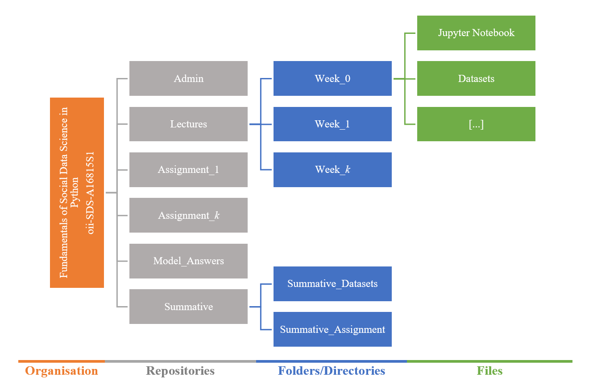
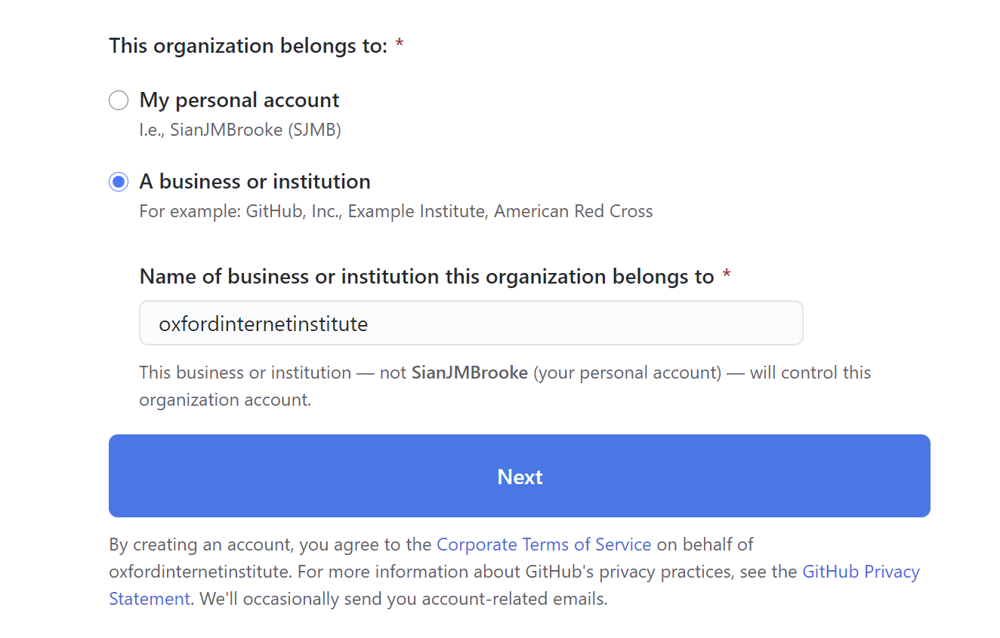
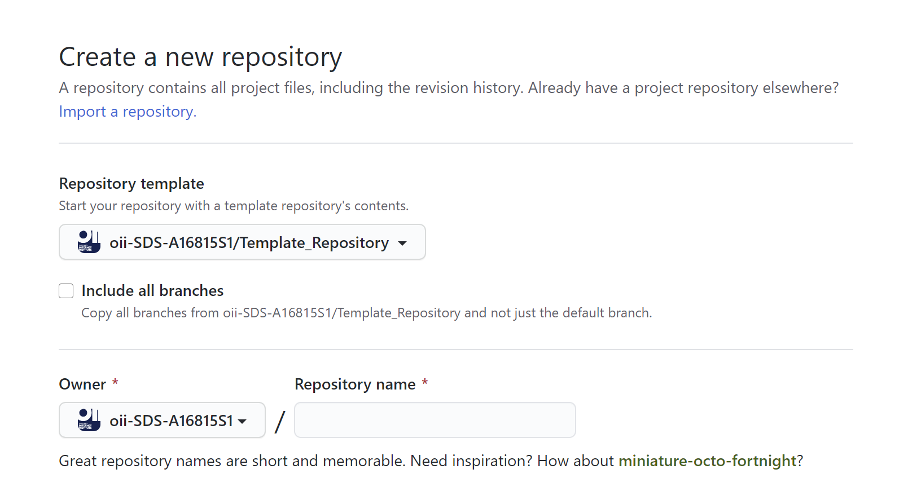

# Guide to GitHub and Setting Assignments For Instructors

This guide is for course Intructors and Teaching Assitants on setting up assignments. The course is a *GitHub Organisation* and the formative assessments for each week have their own repository, the structure (for reference) is shown below.

In the same manner, each course should have it's own GitHub Organisation.

### Setting up a Organisation.
For the sake of consistency, each Organisation should be named in the format oii-SDS-\<*oii course code*\>. For example, the *Fundermentals of Social Data Science* GitHub Organisation is named **oii-SDS-A16815S1**. The Display name is able to be the name of the course, this means that the name can be updated, without breaking the dependencies.

1. In the upper-right corner of any page, click your profile photo, then click **Settings**.
2. In your user settings sidebar, click **Organisations**.
3. In the "Organisations" section, click **New organisation**.
4. Follow the prompts to create your organisation. 

As shown below, please ensure that you designate the organisations owner as the **oxfordinternetinstitute** (or Oxford Internet Institute). You can change this later in the Organisations settings if you forget to do so.

Make sure that you clone/copy the **Admin** repo (the repo that this document is in) to the new Organisation (course). This way, each course will have the full instructions available for all contributors. **Make sure you check the repo for references to FSDS before you make it public**.

### Setting up Repositories
Each organisation has several repos, which will typically follow the structure outlined at the start of this document.
There is also a Template which can be found here: https://github.com/oii-SDS-A16815S1/Template_Repository
The stages are:
1. In the upper-right corner of any page, click "+" , and then click New repository.
2. In the Owner drop-down, select the Organisation (course) you wish to create the repository on.
3. Type a name for your repository, and an optional description.
4. Choose to make the repository either public or private. Public repositories are visible to the public, while private repositories are only accessible to you, and people you share them with. **It is best practise to set a repo as private, and invite students to it with a link.**

You can use this template when you create a new repo in a Organisation. You can also see in the screenshot below that you can select the Organisation which the repo will belong to under **Owner**.

If you forget to assign the repository to the Organisation (course) you can do so later. [Follow this guide to transfer repo ownership](https://docs.github.com/en/enterprise/2.14/user/articles/transferring-a-repository). 

**You can import a existing repo into a Organisation.** When you set up a new Organisation you should import (copy) the **Admin** repo into the new organisation. The image below shows hoe this can be done.

### Inviting Collaborators 
One of the perks of using Organisations is that you can invite collaborators by email. This is a lot easier than asking students for their own individual GitHub handles.

On the main Organisation page (such as for the course), simply click on **People** then select **Invite Members**. A box will pop up and you can begin typing int email addresses.

### Licence
All repositories are licensed with *Attribution-NonCommercial-NoDerivatives 4.0 International (CC BY-NC-ND 4.0)*. This Licence is included by default in the **Template** and will be automatically copied when this template is used. It can be also found in the **Admin** repos.

The terms of ditrbution are:
* **Attribution:** You must give appropriate credit, provide a link to the license, and indicate if changes were made. You may do so in any reasonable manner, but not in any way that suggests the licensor endorses you or your use.
* **NonCommercial:** You may not use the material for commercial purposes.
* **NoDerivatives:** If you remix, transform, or build upon the material, you may not distribute the modified material.

The full link to the Creative Commons Licence can be found here: https://creativecommons.org/licenses/by-nc-nd/4.0/legalcode

