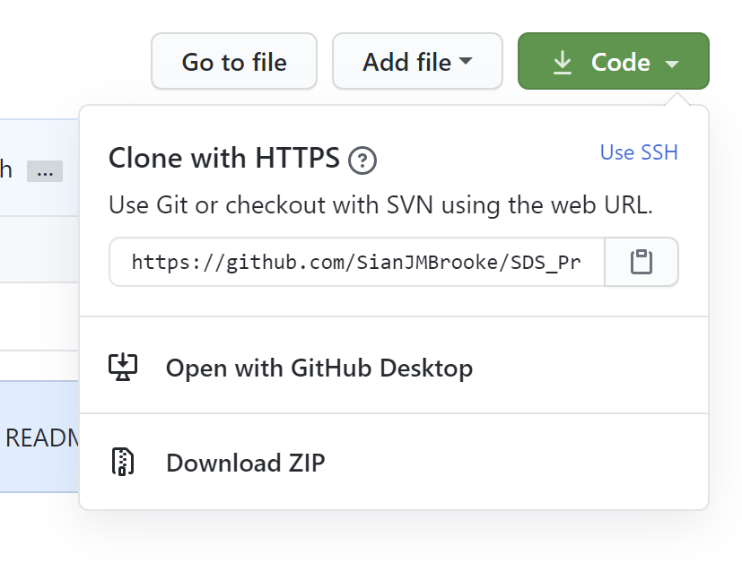

# How to Submit your Assignments

This document contains information on how to submit your assignments via GitHub. The structure of this organisation is Lectures and Assignment Weeks. This means that the Lectures repo contains all of the lectures for the term, but the Assignments are broken into weekly repos. Each Week has the instructions, assignment, and datasets needed to complete the task.

## Submitting Assignments on GitHub Interface
The instructions here are how to download and submit assignments using GitHub in the Browser.
The full guide to using GitHub in thr browser can be found in the appropiate [*Three Ways to use GitHub* document.](/Three-Ways-to-Use-GitHub-WEBINTERFACE.md)



1. The link to the assignments for the week will be sent on **Monday morning**.
2. Accept invitation to assignment. This will automatically create a new repository with your username.
3. **Clone/Download** the repository (as shown in the image above).
4. Work in the Jupyter document on the assignment.
5. Rename the document with your surname in the format: **BROOKE_FSDS_Week01Ex01.ipynb**
6. Upload and **commit changed file directly to the master branch**. Do this before the deadline (the start of the next Lecture).
7. We will automatically download all assignment repositories when the deadline has passed. We will then comment and mark your assignment directly in the main file you submitted.
8. Wait for a new **commit** from us to view our feedback.

## Cloning Course Materials from GitHub using the Command Line
Like above, this section includes infomation on how to clone the GitHub assignment repo.
The full guide to using GitHub from the command line can be found in [*Three Ways to use GitHub* document.](https://github.com/oii-SDS-A16815S1/Admin/blob/master/Three-Ways-to-Use-GitHub-COMMANDLINE.md)


The image above shows the GitHub workflow, including the specific actions to add/commit/push/pull.

#### Cloning
Using the link to the repo as shown in the image above, clone the appropiate repo to your local machine
``` bash
Path/to/directory
git clone https://github.com/oii-SDS-A16815S1/Model_Answers.git
```
#### Updating
``` bash
cd Path/to/Model_Answers
git pull
```
Use Jupyter to annoted and work on local copies.

### Submitting Assignments via Command Line
1. Accept invitation to assignment. This will automatically create a new repository with your username
2. Clone the repository (Terminal)
``` bash
cd Path/to/directory
git clone link.git
```
*Remember: You can obtain the link when you click the "Clone or download" button on the GitHub page for the repository).*

3. Make changes in downloaded file (Jupyter).
4. Commit changed file and push to the master branch before the deadline.
```bash
cd Path/to/directory
git add .
git commit -m 'Submitting assignment'
git push
```
5. We will automatically download all assignment repositories when the deadline has passed. We will then comment and mark your assignment directly in the main file you submitted.
6. Pull the new version we commit to view our feedback.
``` bash
cd Path/to/directory
git pull
```

## Submitting Assignments on GitHub: General Notes
* Do not forget to push! on GitHub Desktop this can be easier to forget to do!
* Always check if the changes are online. If you cannot see them after refreshing, **no one else can.**
* GitHub does all the version control for you. Do not duplicate and rename files (i.e. "Brooke_Final.py" "Brooke_Finally_Final.py" "Brooke_Final_2.py")

Make sure you practise this all before class to ensure it all works smoothly.


